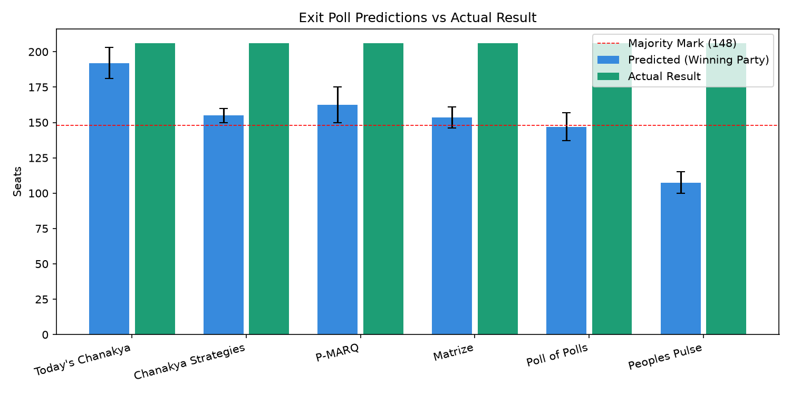

# Exit Poll Accuracy Analysis — West Bengal Assembly Election 2026

## Overview
This repository contains a post-election statistical analysis that benchmarks exit poll predictions from 6 major agencies against the official Election Commission of India (ECI) results. The project demonstrates data science competencies in statistical validation, error tracking, hypothesis testing, and trend modeling on real-world political data.

## Key Findings
* **Prediction Error Analysis:** The ensemble average (Poll-of-Polls) yielded a Mean Absolute Error (**MAE**) of **52.8 seats** and a Root Mean Squared Error (**RMSE**) of **58.3 seats**, primarily driven by a systematic underestimation of the winning party's seat share.
* **Statistical Invalidation:** A normal approximation constructed a 95% Confidence Interval (CI) of **(119.4, 186.2) seats** for the Poll-of-Polls average. The actual outcome of **206 seats** fell completely outside this interval, rejecting the null hypothesis ($H_0$) that the published exit polls were unbiased estimators.
* **Electoral Dynamics:** Applying ordinary least squares (OLS) linear regression on vote shares across 5 election cycles (2016–2026) revealed a significant upward trend for the winning party ($\text{slope} = +7.82\%$ per cycle, $R^2 = 0.72, p < 0.05$). The analysis models how a ~7% vote swing translated into a massive 130-seat gain under the non-linear dynamics of the First-Past-The-Post (FPTP) framework.

## Skills Demonstrated
* **Statistical Estimation & Modeling:** Confidence interval construction, sample variance, normal approximations.
* **Hypothesis Testing:** One-sample $t$-test configurations for bias detection.
* **Regression Frameworks:** Trend lines, $R^2$ evaluations, and $p$-value significance checking.
* **Data Diagnostics:** Implementation of MAE and RMSE metrics to track predictive models against ground truth.

## Repository Structure
```text
├── data/
│   └── exit_poll_data.csv       # Structured polling agency metrics
├── src/
│   └── analysis.py              # Main execution script for calculations & plots
├── README.md                    # Project documentation
## Performance Visualization

